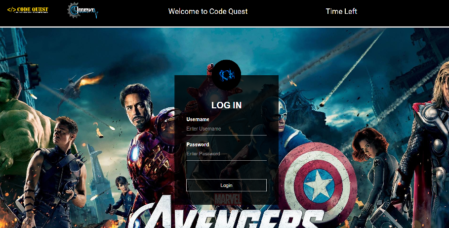
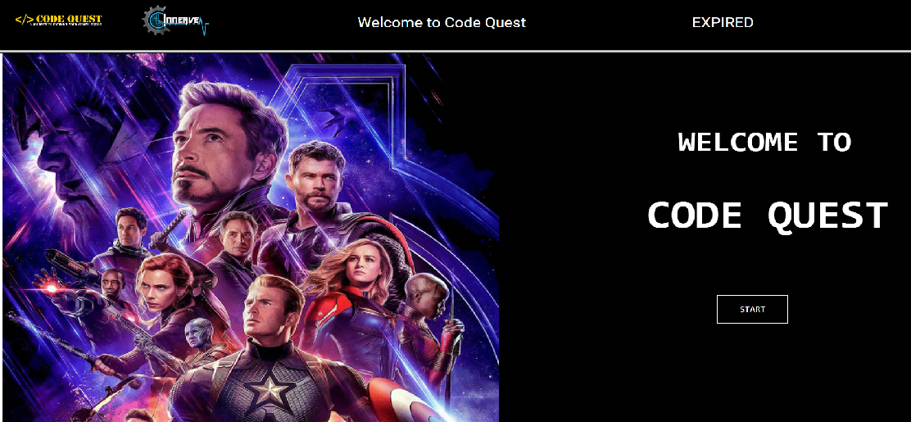
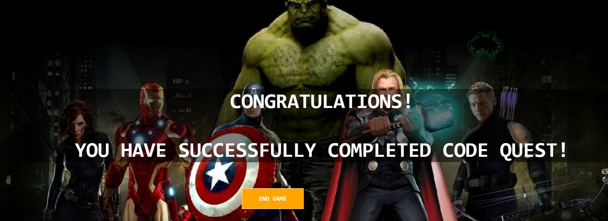

# CODE QUEST!

CodeQuest is a web based treasure hunt developed with HTML, CSS and Javascript. The game has five levels. Each levels has the following parts: 
1)A Data Structures and Algorithm based question   
2)A riddle which will lead the participant to a location  
At the location, a QR code is hidden which when scanned displays an Avengers-themed question. The answer to this question has to be entered in order to proceed to the next level 

The team which solves maximum number of questions in minimum time is the clear winner. This game was successfully hosted for about 150 participants.
 
 # In Action:

This is the login page

This is the main page

Code Quest completed successfully!

# Authors:
Amandeep Kaur (HTML/CSS) 
Drishti Gupta (HTML/CSS) 
Srinidhi Ayyagari (JAVASCRIPT) 
Ruchika Swain (ANDROID APP to scan the secret QR codes) 

# Acknowledgement:
Would like to thank Innerve'19 for providing us the platform to host the same.

# A small catch:
Pressing 'Enter' will not submit the answers.   
The timer was specific to the day the Code Quest was held, so it won't work.  
(Nevertheless, Code Quest can still be played without the timer) 

